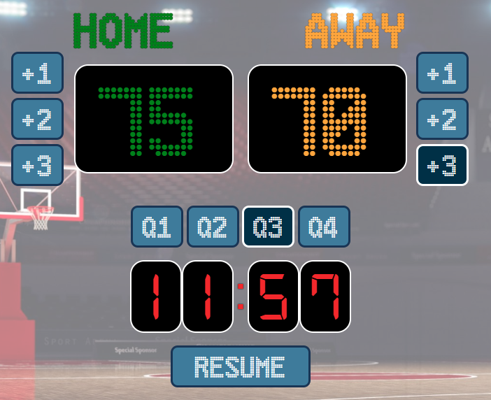

# Basketball Scoreboard
A basketball scoreboard that can be used for keeping track of scores and the game progression.

## Features
* Score
    - Records the score of both HOME and AWAY teams.
    - Provides buttons for incrementing scores by 1, 2 and 3 points respectively.
    - Allows manual input for amending scores if needed.

* Timer
    - Keeps track of the remaining time in the current quarter.
    - Features a blinking sequence when the end of a quarter is reached.
    - Provides buttons to switch between quarters which also serve as an indicator of the current quarter.
    - Provides a button to pause or resume the timer.

### Getting Started
Visit the website [here]()